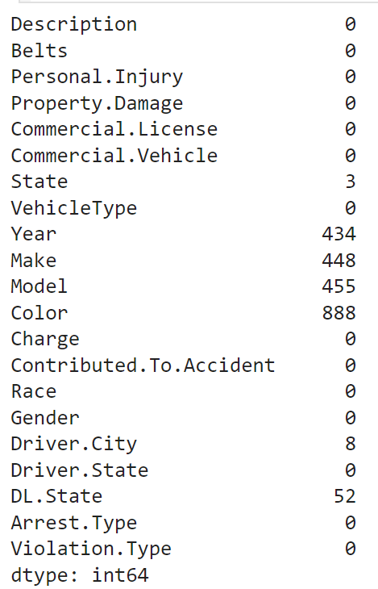
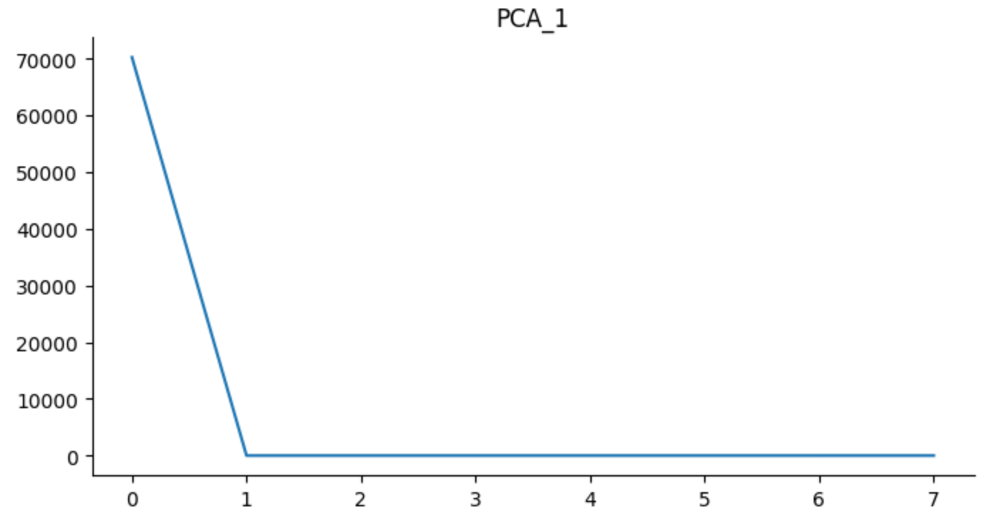

# CSE_151A

## Dataset link: https://www.kaggle.com/datasets/nikhil1e9/traffic-violations

## Jupyter Notebook link - [https://colab.research.google.com/github/devPach4545/CSE_151A/blob/main/CSE_151A_Project.ipynb](https://colab.research.google.com/github/devPach4545/CSE_151A/blob/main/CSE_151A_Project.ipynb#scrollTo=cbaShJfW5Iwj)

## Group Members 
Dhaivat Pachchigar

Rushil Mohandas

Christophian Austin Sulaiman

Vincent Vo

Eyaad

Peeyush Jha

Hoang Le

Feiyang Jiang

Christopherian Austin Sulaiman

Uyen Le

## Project Introduction
We chose to work on this project in large part due to how much of an impact car accidents have in our society, as it is the leading cause of death for people aged 1-54 in the United States. The purpose of our project was to create a model that could predict when the likelihood of a personal injury is higher based on the accident's details. We decided to score our models' success primarily on recall, as the vast majority of accidents do not lead to an injury. Also, we would much rather have our model incorrectly predict an injury when there isn't one, compared to incorrectly predicting no injury when there is one. With a good predictive model, we would be able to better investigate the patterns behind injuries in car accidents in order to hopefully discover what can be done to lower the risk of these injuries happening.

## Methods Overview
### Data Exploration
Before conducting data preprocessing and train the models, it is crucial to get an understanding of the distribution and characteristics of features in the dataset first so that it can be processed in a way that assist how the model gets trained later. Below are some of the exploration we conducted on columns of the original dataset.

> In the 'Violation.Type' feature column, we found that the majority of violation records are warnings or citation, with only a few observations of serious violation. 

> In the 'Gender' column, it is observed that over 67% of the observations of traffic violations have male drivers, and around 32% of the drivers are female.

> To reduce the effect of outliers, we zoomed in on years after 1900 when examine the distribution of the years when the violations took place and were recorded. The result shows that most violation observed in this dataset is clustered around recent decades, especailly around late 1990s and early 2000s, roughly normally distributed.

> This figure examine the relationship between the producing brand of the vehicle and the change of personal injury in traffic accident caused by violations (the target of our prediction). We found that certain producing brands tend to have higher chances in having person injured in accident than others. This suggests that the producing brand of cars can be a useful feature that provide information for our model's prediction.

> Similarly, the relationship between person injured in violation record and the model type of the vehicle is also examined in the plot above by counting the number of injury in records for each model. Some of the models that has higher number of injury instances are also among the brands that has relatively hige rate of injury. Hence, it is worth taking into account the model type when training the models.

### Data Preprocessing
- <b>Data Imputation</b>:
After a rigorous data cleaning and exploratory data analysis, we move on to the data preprocessing stage. The dataset has undergone data imputation to address missing values in columns such as 'State', 'Year', 'Make', 'Model', 'Color', 'Driver.City', and 'DL.State'. The details for those missing values are shown below.

> The imputation was performed using random sampling with the frequency of unique labels taken into account, and taking the median of the respective columns. This is because from analyzing those columns' distribution through `value_counts`, most of the data are centered around a few very frequently appearing labels, and a few are from others.

- <b>Handling Categorical Variables</b>:
To prepare the data for machine learning models, encoding is required, particularly for categorical variables. The dataset contains various categorical features such as Yes/No indicators and non-comparable features like the names of car companies. We'll apply the following strategies for encoding:

    1. **Binary Encoding for Yes/No Features:**
   - We will convert Yes/No features into binary representations (0 for No, 1 for Yes) to make them compatible with machine learning algorithms.

    2. **One-Hot Encoding for Non-Comparable Categorical Features:**
   - For non-comparable categorical features, such as car company names and other descriptive attributes, we will use one-hot encoding. This technique creates binary columns for each category and indicates the presence of the category with a 1.

- <b>Normalization Scaling</b>:
Normalization is crucial for ensuring that features with different scales do not unduly influence the machine learning model. We will apply normalization to scale numerical features to a standard range, typically between 0 and 1. This step enhances the performance and convergence of machine learning algorithms.

> This normalization step is chosen because like this plot for distribution of values in PCA1 of Description column shown above, many columns in our resulting dataframe does not follow a normal distribution.

**Summary of Data Preprocessing Steps:**

1. Imputation: Missing values in 'State', 'Year', 'Make', 'Model', 'Color', 'Driver.City', and 'DL.State' were addressed using random sampling and median imputation.

2. Encoding:
   - Binary Encoding: Yes/No features will be converted to binary representations (0 or 1) This includes things such as driver being male/female, whether or not there was a personal injury, and whether or not there was property damage, to name a few.
   - One-Hot Encoding: Non-comparable categorical features will undergo one-hot encoding.

3. Normalization: Numerical features will be normalized to a standard range for optimal model performance.

By completing these preprocessing steps, the dataset will be ready for training machine learning models, ensuring that it is appropriately formatted and scaled for accurate and reliable predictions.
## Finalized dataframe: 

### Description for the columns
- 'Citation': This column indicates whether a citation or ticket was issued for the incident.
- 'SERO': This column refers to some specific type of incident or report.
- 'Warning': This column indicates if a warning was given instead of a citation.
- Columns with race categories ('ASIAN', 'BLACK', 'HISPANIC', 'NATIVE AMERICAN', 'OTHER', 'WHITE'): These columns represent different racial groups and are used to record the race of the individuals involved in the incident.
- Columns with state abbreviations ('AB', 'AK', 'AL', ..., 'XX'): These columns represent different states or provinces and are used to record the state or province where the incident occurred or where the individuals involved are from.
- Columns with 'Driver.State_' and 'DL.State_' prefixes: These columns represent the state or province associated with the driver's license or state of residence for the driver involved in the incident.
- Columns with 'F' and 'M': These columns represent the gender of the individuals involved, with 'F' for female and 'M' for male.
- 'Belts_No' and 'Belts_Yes': These columns indicate whether seat belts were used or not during the incident.
- 'Contributed.To.Accident_No' and 'Contributed.To.Accident_Yes': These columns indicate whether the individual(s) contributed to the accident or not.
- 'Commercial.License_No' and 'Commercial.License_Yes': These columns indicate whether the driver involved had a commercial driver's license or not.
- 'Commercial.Vehicle_No' and 'Commercial.Vehicle_Yes': These columns represent whether the vehicle involved was a commercial vehicle or not.
- 'Columns with 'VehicleType_' prefix: These columns represent different types of vehicles involved in the incident, such as motorcycles, automobiles, trucks, buses, and others.
- 'Property.Damage_No' and 'Property.Damage_Yes': These columns indicate whether there was property damage or not as a result of the incident.
- 'Personal_injury': This column indicates whether there were any personal injuries sustained during the incident.
### Model 1 - Logistic Classification
- **Overview**: 
A logistic classification could be a good start for this project and serves as a baseline model for the rest of the project. It is designed well for classification tasks, especially binary classification tasks like the one we have in this project due to the sigmoid function behind the scene. It is also a model with relatively simple underlying structure, so it is worth trying how well it could capture the relationships within the dataset so that we can gradually improve on later models based on the result from a simplier model.
- **Detailed Procedure**: 
We implement a logistic regression classifier with a max iteration of 1500 and uses the default l2 ridge regression regularizer to reduce complexity of the model. In order to achieve better performance, we also performed hyper-parameter tuning using random search algorithm on the strength of regularization in range 0.001 to 100. After that, we update the hyperparameters based on the searched result and tested for overfitting through k-fold cross validation to see whether our model overfit on training set or not.

### Model 2 - Neural Networks
- **Overview**: A Neural Network can be advantageous in capturing complex relationships within our dataset. It can handle non-linearities in the data and adapt to the interactions between features such as description of violation, seatbelt usage, injury occurrence, vehicle details, state, year, make, gender, etc.
The scalability of neural networks enables them to adapt to the complexity of the dataset. By adjusting the number of hidden layers and neurons, this model can accommodate diverse accident scenarios. This adaptability is particularly beneficial when dealing with a vast range of conditions and circumstances that may lead to personal injuries in car accidents. Training a neural network on a comprehensive set of accidents enhances its ability to generalize and make accurate predictions across various scenarios. This is crucial for creating a robust model capable of handling the complexities inherent in predicting personal injuries.
- **Detailed Procedure**:
We used a Sequential neural network with 7 layers. The first layer had 12 units with a sigmoid activation function. The second layer had 36 layers with a relu activation. The third had 72 layers with tanh activation, the fourth had 24 units with tanh activationl, the fifth had 48 units with relu activation, the sixth had 60 units with tanh activation. The output layer had a sigmoid activation function.
We compiled the neural network with rmsprop optimizer, and binary cross entropy as our loss function.
For hypertuning the parameters, we used grid search.
We also used cross validatoin in our model.

### Model 3 - Linear Support Vector Machine
- **Overview**: 
First, we thought we would run Decision trees, but after carefull consideration from all group members, we have decided to go with SVM. Since, they are good for binary classification and we also have binary classification problem. This model allows us to classify the two classes in our target column with boundary line while maximizing the decision margin, allowing the model to be more generalized to future unseen data, making it more robost as compared to other models like logistic regression.
- **Detailed Procedure**:
We performed oversampling on the training set prior to training the SVM model this time to reduce the impact of unbalanced classes. We then trained the model with linear SVM on the oversampled training set. To verify whether our model is overfitting on the training set, we also separate the data into train, test, and validation set, and perform evaluation using metrics like recall and precision on each set.

## Results
### Model 1 (Logistic Classification) - Result
**From the classification report for training data:**

The precision value for class 0 is 0.99 while the precision value for class 1 is 0.57

The recall value for class 0 is 1 while the value for class 1 is only 0.23

The F1-score value for class 0 is 0.99 while the F1-score value for class 1 is 0.33 

The accuracy of the training data for this model is 0.99

> The classification report for the training dataset. The report will summarize the performance of the model on the dataset.

The MSE for training data is 0.011009786476868327

From the confusion matrix: the value for true negative is 44345, the value of false positive is 89, the value for false negative is 406 and the value for true positive is 120

> The confusion matrix of the training dataset. It is a table and will print out the value of true positive, true negative, false positive and false negative. 

**From the classification report for testing data:**

The precision value for class 0 is 0.99 while the precision value for class 1 is 0.52

The recall value for class 0 is 1 while the value for class 1 is only 0.23 

The F1-score value for class 0 is 0.99 while the F1-score value for class 1 is 0.31

The accuracy of the training data for this model is 0.99

> The classification report for the testing dataset. The report will summarize the performance of the model on the dataset.

The MSE for testing data is 0.010533807829181495

From the confusion matrix: the value for true negative is 13868, the value for false positive is 31, the value for false negative is 117 and the value for true positive is 34

> The confusion matrix of the testing dataset. It is a table and will print out the value of true positive, true negative, false positive and false negative. 

**From the classification report for validation data:**

The precision value for class 0 is 0.99 while the precision value for class 1 is 0.54

The recall value for class 0 is 1 while the value for class 1 is only 0.24 

The F1-score value for class 0 is 0.99 while the F1-score value for class 1 is 0.34 

The accuracy of the training data for this model is 0.99

> The classification report for the validation dataset. The report will summarize the performance of the model on the dataset.

The MSE for validation data is 0.010943060498220641

From the confusion matrix: the value for true negative is 13868, the value of false positive is 31, the value for false negative is 117 and the value for true positive is 34

> The confusion matrix of the validation dataset. It is a table and will print out the value of true positive, true negative, false positive and false negative. 

The model will lean toward the underfitting in the fitting graph because the precision/recall for the training and testing data is too low.

> Precision, recall curve for logistic regression. The graph represents the trade-off between precision and recall of a model for different values. 

**Conclusion section: What is the conclusion of your 1st model? What can be done to possibly improve it?**

After training a logistic regression model on our dataset, we've concluded that it's a fundamental step towards understanding its predictive capabilities. Logistic regression is well-suited for binary classification problems, but to truly bring out its effectiveness, we applied key performance metrics such as accuracy, precision, recall, and the F1 score to the predictions made on the test set. These metrics gave us a comprehensive view of how accurately the model predicts outcomes, balancing the rate of true positives against false positives and negatives. However, we realize that we did not create a confusion matrix which would make this all so much easier. This is a crucial next step, to understand the types of errors our model might be making. Additionally according to the report, both the training and testing sets exhibit similarly high error rates, signaling relatively weak performance. This suggests that the model leans towards the left side, or the underfitting portion, of the model fitting graph. To improve this we could make the model more complex by increasing the model complexity such as utilizing neural networks.

To enhance the model's performance, we could consider several strategies. Firstly, implementing cross-validation, like K-Fold or Repeated K-Fold, could provide a more robust assessment of the model's performance by training it on different subsets of the data. This would help us understand how well the model generalizes to new, unseen data. Secondly, tuning the hyperparameters of the logistic regression model could significantly improve its performance. Lastly, if logistic regression seems too simplistic for our dataset's complexity, we are open to exploring more advanced models like decision trees, random forests, or even neural networks, which could potentially offer better accuracy and insights.

**Where does your model fit in the fitting graph**

From the classification report for both training and testing data, the precision and recall for predicting class 1 is low for training and testing data. We chose to focus on the precision and recall for class 1 (person injured) as the metrics for measurement to avoid bias because the dataset has a lot of instances for class 0 but not a lot for class 1. According to the report, the error is similarly high for both testing and training test, indicating relatively poor performance. So the  model will towards to the left in the underfitting part of the fitting graph.

### Model 2 (Neural Networks) - Result
The value for training loss is 0.0494 while the training accuracy is 0.9892

The value for testing loss is 0.0487 while the testing accuracy is 0.9898

The difference in loss is 0.0007 and the difference in accuracy is 0.0006

The best value for val_loss is 0.04227360710501671

**From the classification report for training data:**

The precision value for class 0 is 0.99 while the precision value for class 1 is 0.81

The recall value for class 0 is 1 while the value for class 1 is only 0.10

The F1-score value for class 0 is 0.99 while the F1-score value for class 1 is 0.19

The accuracy of the training data for this model is 0.99

> The classification report for the training dataset. The report will summarize the performance of the model on the dataset.

From the confusion matrix of testing data: the value for true negative is 13896, the value of false positive is 3, the value for false negative is 144 and the value for true positive is 7

> The confusion matrix of the testing dataset. It is a table and will print out the value of true positive, true negative, false positive and false negative.

The model will lean toward the underfitting in the fitting graph because the precision/recall for the training and testing data is too low.

> Precision, recall curve for neural network. The graph represents the trade-off between precision and recall of a model for different values of testing data. 

**Conclusion section (Milestone 4 and model 2): What is the conclusion of your 2nd model? What can be done to possibly improve it? How did it perform to your first and why?**
- After running neural network we got the accuracy of 0.98, precisionn of 0.531, and, recall of 0.225. It seems that our model has a lot of true negatives (13869) with compare to true positives only 34. Neural network did not provide a significant improvemnet over logistic regression because our model 1 got the accuracy of 0.98 as well. Both of our models identified same number of true negatives. We are thinking about oversampling the data to get rid of class imbalance.

### Model 3 (Linear Support Vector Machine) - Result
**From the classification report for training data:**

The precision value for class 0 is 0.92 while the precision value for class 1 is 0.83

The recall value for class 0 is 0.81 while the value for class 1 is only 0.93 

The F1-score value for class 0 is 0.86 while the F1-score value for class 1 is 0.88 

The accuracy of the training data for this model is 0.87

> The classification report for the training dataset. The report will summarize the performance of the model on the dataset.

The MSE for training data is 0.1303

From the confusion matrix: the value for true negative is 36127, the value of false positive is 8307, the value for false negative is 3147 and the value for true positive is 41287

> The confusion matrix of the training dataset. It is a table and will print out the value of true positive, true negative, false positive and false negative. 

**From the classification report for testing data:**

The precision value for class 0 is 1 while the precision value for class 1 is 0.05

The recall value for class 0 is 0.82 while the value for class 1 is only 0.81

The F1-score value for class 0 is 0.90 while the F1-score value for class 1 is 0.09 

The accuracy of the training data for this model is 0.82

> The classification report for the testing dataset. The report will summarize the performance of the model on the dataset.

The MSE for testing data is 0.1875

From the confusion matrix: the value for true negative is 11291, the value of false positive is 2608, the value for false negative is 26 and the value for true positive is 125

> The confusion matrix of the testing dataset. It is a table and will print out the value of true positive, true negative, false positive and false negative. 

**From the classification report for validation data:**

The precision value for class 0 is 1 while the precision value for class 1 is 0.05

The recall value for class 0 is 0.82 while the value for class 1 is only 0.80

The F1-score value for class 0 is 0.90 while the F1-score value for class 1 is 0.09 

The accuracy of the training data for this model is 0.82

> The classification report for the validation dataset. The report will summarize the performance of the model on the dataset.

The model will lean a bit toward the underfitting in the fitting graph because the value of precision in the testing data is too low.

> Precision, recall curve for linear SVM. The graph represents the trade-off between precision and recall of a model for different values. 

## Discussion
### Model 1: Logistic Regression
- The reason we chose this model is because during the first couple of weeks, we learned that logistic regression was the best model we covered for binary classification due to its ability to output the probability of an outcome. We are also trying to predict if there was an injury in an accident or not. Therefore, logistic regression would predict the probability of someone getting injured. The second reason we chose logistic regression is because it was fast on larger datasets. However, from the results above, we can conclude that our logistic regression model is heavily biased towards the 'no injury' class. This happened because we did not know about oversampling at that time, and we did not realize that we had a data imbalance. There are just very few observations that resulted in injury.

### Model 2: Neural Networks
- Neural networks are like a god-given gift to machine learning engineers. They are best for almost any type of supervised learning. They can learn and predict anything. Accuracy may differ, but we decided to go with neural networks because we thought it was a better model over logistic regression. They can predict multiclass labels as well, and we thought that our first model had suspiciously high accuracy, so using neural nets would give us a more realistic answer. But, to our dismay, the neural network also gave us a very high accuracy, and we concluded that we would have to design an intricate neural network for a realistic result.

- First, we ran a neural network without K-fold cross-validation. To clear the bias, we tried to do K-fold cross-validation, but that did not help much either. Our accuracy increased only a little bit (0.006) after K-fold cross-validation. We spotted that the main issue was due to class imbalance. And, we learned that oversampling is a method to address imbalanced classes. In our case, persons with injuries were way fewer than people without injuries. After oversampling, we were able to balance both of our classes.

### Model 3: Linear SVM
- Initially, we thought decision trees would be better, but after learning about SVMs, we realized that SVMs are better for binary classification because there is a hyperplane that can distinguish two classes. The more the distance of the support vector from the planes, the better our model performs. Our training accuracy for the training set was 0.87, and the testing accuracy was 0.81. These were lower than our two previous models, but the precision, recall, and F1-score were better than the previous two models, indicating that our final and third model was more believable compared to models one and two.

## Conclusion
Through the process of the three models we implemented in this project, we observed a gradual improvement in the overall performance of the model in which the recall and precision for class 1 (people injured) got improved. However, since the dataset we use for this project contains unbalanced target variable, hence it might limit the space of improvement for our models. For instance, in our last SVM model, in order to reduce the negative impact of unbalanced class, we introduced oversampling to the training set in hope to improve the performance on class 1. And looking at the results from confusion matice, the model tends to make more predictions on class 1, having less false negatives, which is good in the setting of our project. Hence, some things we could have done differently is to incorporate either oversampling or adding balaced weight to classes for our first two models to reduce the effect of unweighted target classes.

Other things that we could consider to make the model perform better is to do feature selection. Currently for all three models, we trained them on all features available on the dataset, but given the nature of our target variable, some of those features might not be so helpful and might introduce noise to the model that reduced its performance. One possible way could be using logistic regression with L1 regularizer, which will set the coefficient of irrelavent fetures close to 0, helping us to set appart helpful features from the noise, and then apply only helpful features to future models in hope of getting better performance.

As for other possibilities that is worth trying in future studies, we can also consider combining the results of different models and do an ensemble of different classification models, and used the combined results from multiple models to make more accurate predictions. However, this does require those models to have decent or relatively good performance in recall and accuracy for the ensemble to produce better results.

## Collaboration
All group members participated in the discussion of the project and contribute to different parts of the project actively. Below is the detailed list of tasks each member contributed to.

- Dhaivat Pachchigar

- Rushil Mohandas

- Christophian Austin Sulaiman

- Vincent Vo

- Eyaad

- Peeyush Jha

- Hoang Le: data preprocessing, encoding parts of the data, and wrote the Results for 3 models and where the model fit in the fitting graph for model 2.

- Feiyang Jiang: data imputation, column encoding, hyperparameter tuning and cross validation for model 1 and 2, and wrote the conclusion.

- Christopherian Austin Sulaiman

- Uyen Le
